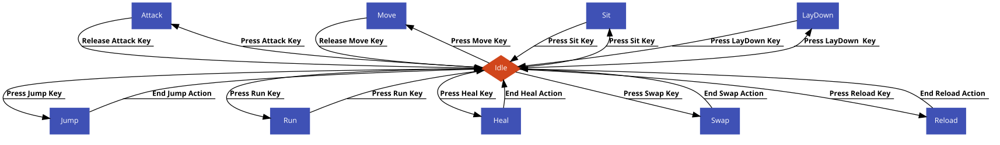
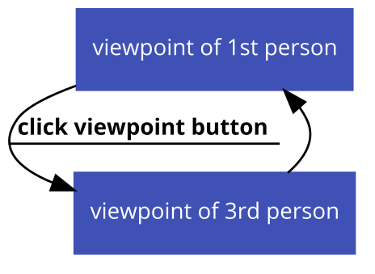
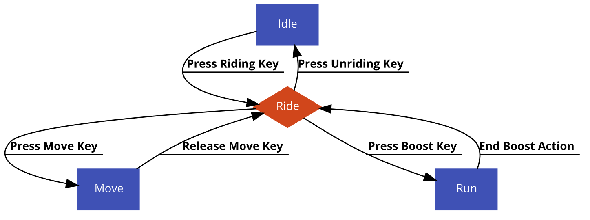
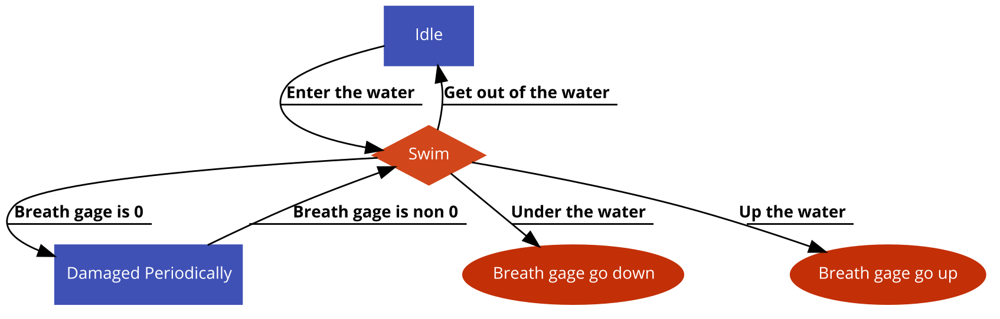
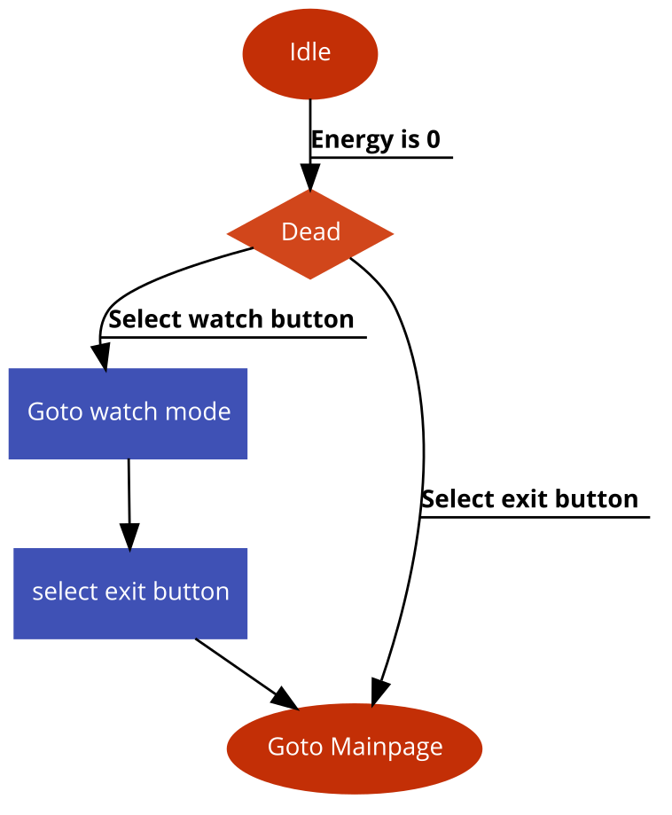
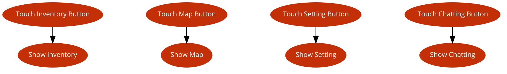

# 시스템 정의
  - 플레이어 캐릭터의 동작을 결정하는 시스템
  
# 시스템 설명
  - 플레이어 캐릭터를 조작하는 버튼 존재
    - 이동, 앉기, 눕기, 점프, 달리기, 재장전의 행동이 가능
    - 공격 버튼을 누르면 조준점이 위치한 곳으로 사격
    - 회복약 버튼을 누르면 현재 설정된 회복약을 사용
    - 무기1, 무기2 버튼을 누르면 해당 무기로 현재무기 변경
  - 사망시 게임관전 및 나가기를 선택 가능
  - 차량에 탑승하거나 물에서 수영을 하는 것이가능
    - 잠수시 호흡게이지가 있어서 호흡게이지가 0이되면 데미지를 입음
  - 그외 인벤토리, 지도, 설정, 채팅 등 게임플레이에 도움을 주는 화면들을 띄워주는 버튼 존재
  
 
 

# 기본실행순서
## 캐릭터 일반 동작

번호 | 사용자 행위 | 화면상의 결과
:-------: | :-------: | :-------:
1 | 공격버튼을 터치 | 조준점이 위치한 곳으로 사격 및 공격
1 | 이동버튼을 터치 | 플레이어 캐릭터가 해당 방향으로 이동
1 | 앉기버튼을 터치 | 플레이어 캐릭터가 앉음
1 | 눕기버튼을 터치 | 플레이어 캐릭터가 누음
1 | 점프버튼을 터치 | 플레이어 캐릭터가 점프
1 | 달리기 버튼을 터치 | 플레이어 캐릭터가 달림
1 | 회복약버튼을 터치 | 플레이어 캐릭터가 현재 선택된 회복약을 사용
1 | 무기1버튼을 터치 | 플레이어 캐릭터가 현재 무기를 무기1로 변경
1 | 무기2버튼을 터치 | 플레이어 캐릭터가 현재 무기를 무기2로 변경
1 | 재장전 버튼을 터치 | 플레이어 캐릭터가 무기를 재장전

## 캐릭터 시점전환

번호 | 사용자 행위 | 화면상의 결과
:-------: | :-------: | :-------:
1 | 3인칭 상태에서 시점전환버튼을 터치 | 플레이어 캐릭터 시점을 1인칭으로 전환
1 | 1인칭 상태에서 시점전환버튼을 터치 | 플레이어 캐릭터 시점을 3인칭으로 전환

## 차량 탑승시 캐릭터 동작

번호 | 사용자 행위 | 화면상의 결과
:-------: | :-------: | :-------:
1 | 차량근처에서 차량탑승 버튼을 터치 | 차량에 탑승
2 | 이동버튼을 사용 | 차량이 이동
2 | 부스터 버튼을 사용 | 차량부스터
3 | 차량내리기 버튼을 누름 | 차량에서 내림

## 물속에서의 캐릭터 동작

번호 | 사용자 행위 | 화면상의 결과
:-------: | :-------: | :-------:
1 | 플레이어 캐릭터가 물에 들어감 | 수영상태로 전환
2 | 물속에서 호흡게이지가 0이됨 | 일정간격으로데미지를 입음
3 | 플레이어 캐릭터가 물에서 나옴 | 일반상태로 전환

## 사망시 캐릭터 동작

번호 | 사용자 행위 | 화면상의 결과
:-------: | :-------: | :-------:
1 | 플레이어 캐릭터의 체력이 0이됨 | 플레이어 캐릭터가 사망
2 | 관전하기 버튼을 클릭 | 게임관전
2 | 나가기 버튼을 클릭 | 로비화면으로 이동

## 팝업화면 관련 동작

번호 | 사용자 행위 | 화면상의 결과
:-------: | :-------: | :-------:
1 | 가방버튼을 터치 | 플레이어 캐릭터 가방 화면을 띄움
1 | 지도버튼을 터치 | 현재게임 지도화면을 띄움
1 | 설정화면을 터치 | 설정화면을 띄움
1 | 채팅화면을 터치 | 채팅화면을 띄움

 
 