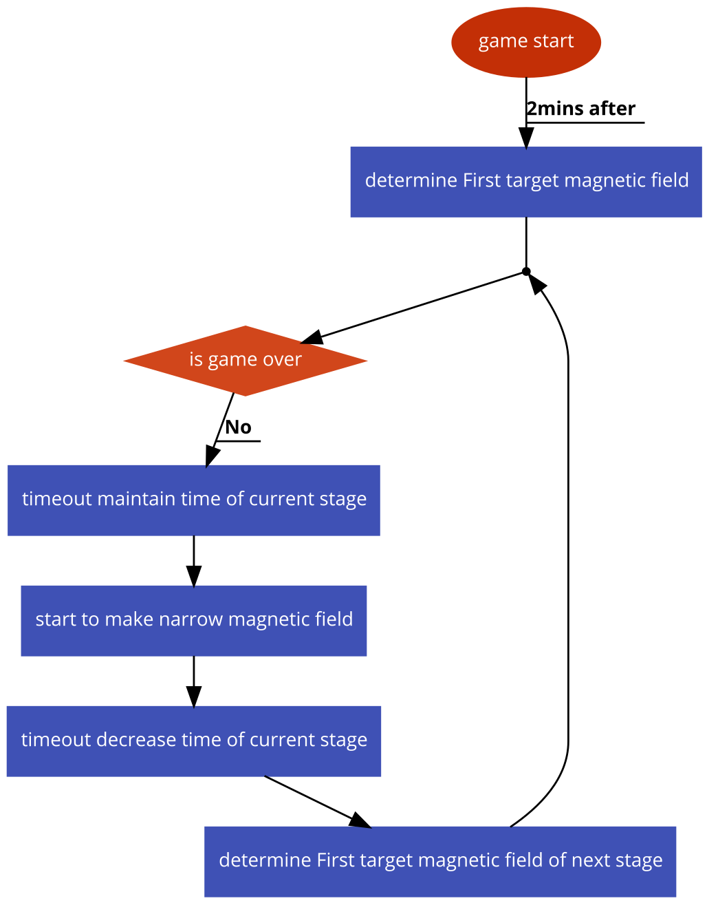

# 시스템 정의
  - 게임의 경기범위를 제한하는 자기장에 관한 시스템
  
# 시스템 설명
  - 자기장 시스템을 이용해 경기범위를 점점 좁혀나감  -> 게임종료를 강제함
  - 자기장 밖에 있는 캐릭터들은 데미지를 입음
    - 게임 후반부가 될 수록 입는데미지가 높아짐
    - 초당 데미지는 0.4에서 11까지 증가
  - 절차
    - 일정시간마다 최종적으로 좁혀지게 될 목표자기장을 지도에 미리 보여줌
      - 자기장의 위치는 랜덤
      - 게임시작 2분뒤 첫번째 자기장이 결정
    - 보여준뒤 일정시간이 지나면 자기장을 목표대로 좁혀나가기 시작
    - 목표자기장으로 좁히는것이 완료되면 다시 다음목표 보여주고 반복
 
 

# 기본실행순서
  

번호 | 사용자 행위 | 화면상의 결과
:-------: | :-------: | :-------:
1 | 게임시작후 2분이지남 | 첫번째 목표자기장 위치가 정해짐
2 | 현재단계의 자기장 유지시간이 종료 | 목표자기장으로 자기장 범위가 좁혀지기 시작함
3 | 현재단계의 자기장 감소시간이 종료 | 다음단계의 목표자기장 위치가 정해짐
4 | 1명의 플레이어만 생존 | 경기종료

 
 