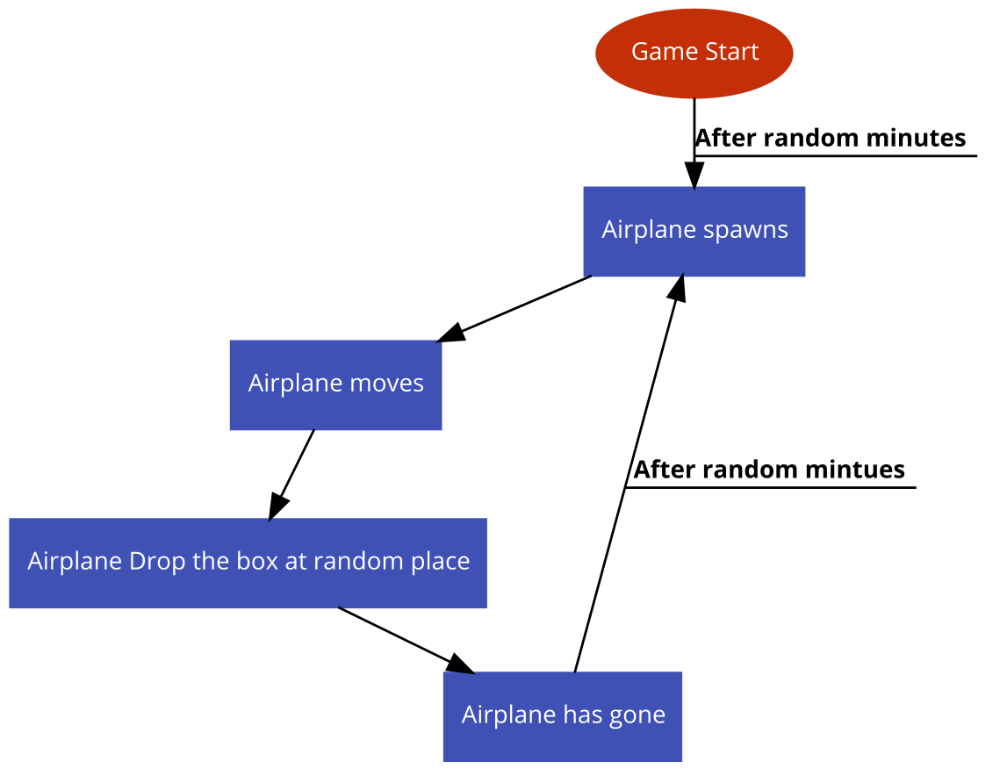

# 시스템 정의
  - 게임 중 일정 시간마다 플레이어들에게 강력한 무기를 얻을 기회를 제공하는 시스템
  
# 시스템 설명
  - 게임 도중 비행기가 돌아다니며 일정시간마다 랜덤한 장소에 보급상자를 떨어트림
    - 보급이 등장하는 시간간격은 랜덤하게 결정됨
    - 비행기는 맵을 일직선으로 관통하며 랜덤한 장소에 상자를 떨어트림
  - 보급상자안에는 일반적으로는 얻을 수 없는 강력한 무기가 존재
    -  Groza, AUG A3, M24, AWM, .300 매그넘, Mk14, M249, 길리슈트, 15배율 스코프, 3레벨 헬멧, 8배율 스코프, 4배율 스코프, 의료용 키트, 아드레날린 주사기 등
  - 플레이어가 위험을 감수하고 더 큰 보상을 얻을지, 위험을 회피할지 선택하게 함으로서 전략적인 요소를 더함
 
 

# 기본실행순서
  

번호 | 사용자 행위 | 화면상의 결과
:-------: | :-------: | :-------:
1 | 게임시작 후 랜덤한 시간이 지남 | 보급상자를 전달하는 비행기가 스폰됨
2 | 비행기가 정해진 경로로 이동 | 랜덤한 장소에 상자를 떨어트림
3 | 비행기가 지난후 랜덤한 시간이 지남 | 보급상자를 전달하는 비행기가 스폰됨

 
 