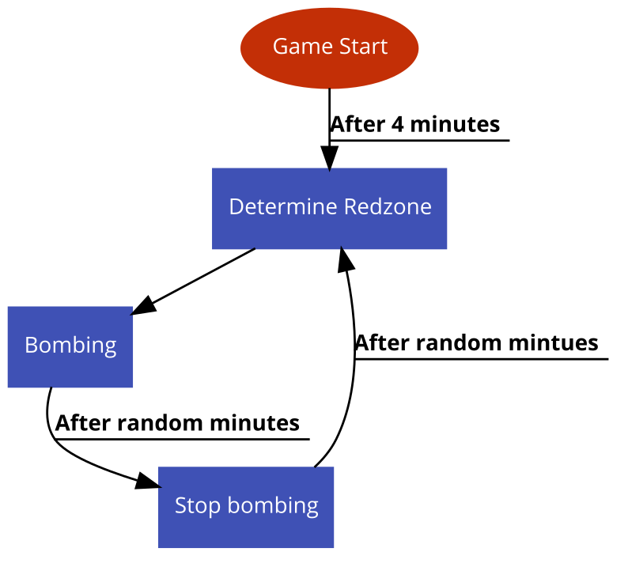

# 시스템 정의
  - 일정 시간마다 일정 범위내의 지역에 폭격을 가하는 시스템
  
# 시스템 설명
  - 일정시간마다 맵 전체 구역에 무작위로 레드 존이라는 빨간색 원이 지정되며,   지정된지 일정 시간 뒤에 원내부에 포격이 떨어짐
  - 포격에 맞을 경우 즉사
  - 게임이 시작되고 4분뒤에 첫번째 레드존이 지정됨
  - 위치, 폭발 간격, 폭발 시간, 폭발 횟수는 모두 랜덤하게 결정됨

 
 

# 기본실행순서
  

번호 | 사용자 행위 | 화면상의 결과
:-------: | :-------: | :-------:
1 | 게임시작후 4분이 지남 | 첫번째 레드존이 지정됨
2 | 레드존에 포격시작 | 포격에 맞은 플레이어는 사망
3 | 레드존 폭발시간이 끝남 |  레드존 포격이 중지됨
4 | 레드존 폭발간격시간이 끝남 | 레드존이 다시 지정됨

 
 