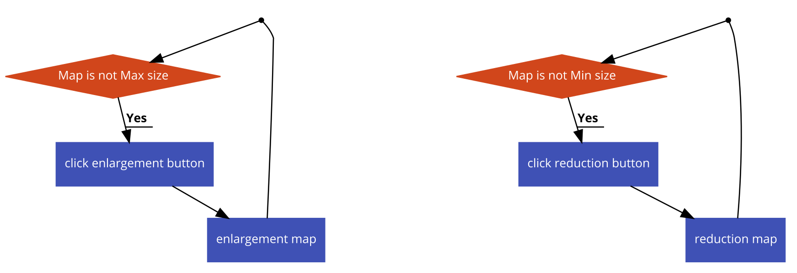

# 시스템 정의
  - 현재 게임내의 지도를 보여주는 시스템
  
# 시스템 설명
  - 우측의 + -버튼으로 지도 확대, 축소 가능
  - 지도위를 클릭하면 클릭한 위치에 마커 생성
  - 마커 제거하기 버튼으로 지도위의 마커 제거 가능
  - 내 위치 표시 버튼으로 마커를 현재 내 위치에 생성

 
 

# 기본실행순서

## 마커생성

번호 | 사용자 행위 | 화면상의 결과
:-------: | :-------: | :-------:
1 | 지도위의 장소를 터치 | 터치한 위치에 마커생성 
2 | 마커제거하기 버튼 터치 | 마커가 사라짐
3 | 내위치 표시하기 버튼 터치 |  마커가 현재 내위치에 생성

## 지도 확대/축소

번호 | 사용자 행위 | 화면상의 결과
:-------: | :-------: | :-------:
1 | 확대버튼클릭 | 지도가 확대됨
2 | 지도가 최대크기 도달 | 확대 불가능
1 | 축소버튼 클릭 | 지도가 축소됨
2 | 지도가 최소크기 도달 | 축소 불가능

 
 