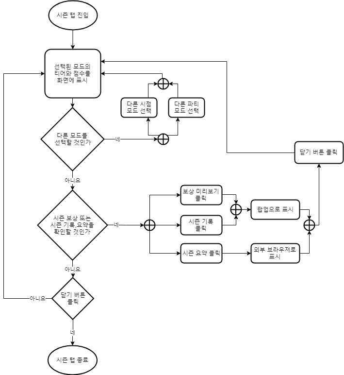
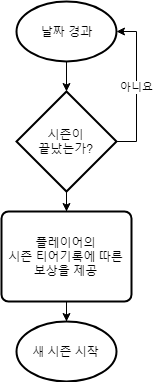

# 시스템 정의
  - 시즌 정보와 플레이어의 랭킹 정보를 제공하는 시스템
  - 랭킹 시스템의 요소들은 매 시즌마다 초기화되어 이루어지므로, 랭킹과 시즌 시스템은 같이 이야기 하도록 함

# 시스템 설명
  - 약 3개월마다 새로운 시즌을 시작
  - 매 시즌마다 플레이어의 개인 랭킹과 티어를 매김
  - 시즌이 끝날 때 플레이어들에게 랭킹과 티어에 따른 보상 제공

 
 

## 시즌 탭 UI

번호 | 사용자 행위 | 화면상의 결과
:-------: | :-------: | :-------:
1 | 시즌 탭 진입 | 티어와 점수를 화면에 표시 기본적으로 이전에 선택했던 모드로 표시
2 | 다른 모드를 선택 | 화면에 선택된 티어와 점수를 표시
3-1 | 보상 미리보기 또는 시즌 기록 클릭 |  팝업으로 해당하는 내용을 보여줌
3-2 | 시즌 요약 클릭 | 외부브라우저로 표시
4-1 | 팝업화면에서 닫기 버튼 클릭 | 팝업이 닫힘
4-2 | 외부브라우저에서 닫기 버튼 클릭  | 팝업이 닫힘
5 | 닫기 버튼 클릭 | 시즌 탭을 종료함
 

## 시즌 보상 시스템

 
 
