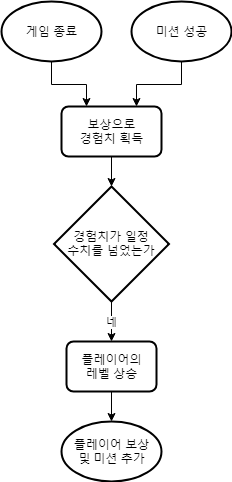

# 시스템 정의
  - 플레이어의 경험치에 따라 개인 레벨이 높아지는 시스템

# 시스템 설명
  - 플레이어는 게임 결과나 미션 등에서 경험치를 얻을 수 있음
  - 경험치가 일정 값 이상이 되면 레벨이 높아짐
  - 플레이어 레벨이 높아짐에 따라 보상과 새로운 미션 등이 주어짐
  - 커뮤니티 등 다른 시스템에서 레벨을 기준으로 삼기도 함
 
 

# 기본실행순서

번호 | 사용자 행위 | 화면상의 결과
:-------: | :-------: | :-------:
1-1 | 게임 종료 | 보상으로 경험치 획득
1-2 | 미션 성공 | 보상으로 경험치 획득

 
 
