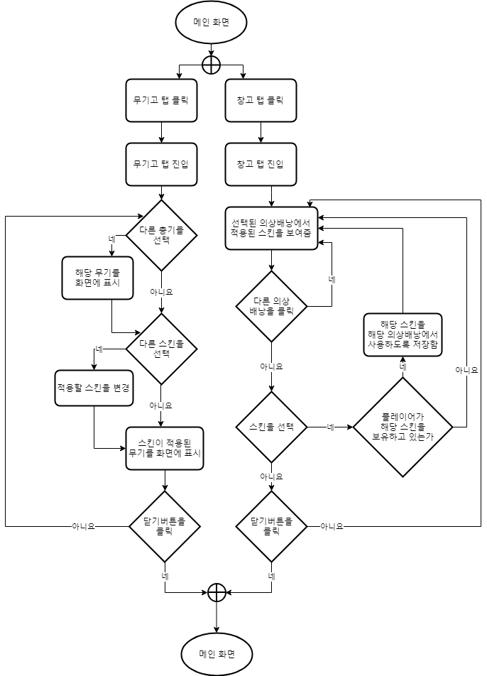

# 시스템 정의
  - 총기나 캐릭터 등에 스킨을 적용하는 시스템

# 시스템 설명
  - '무기고' 탭에서는 무기에 스킨이 적용된 모습을 자세히 확인 가능
  - '창고' 탭에서는 모든 종류의 스킨을 적용할 수 있음
 
 

# 기본실행순서

번호 | 사용자 행위 | 화면상의 결과
:-------: | :-------: | :-------:
1-1 | 무기고 탭 클릭 | 무기고 탭 진입
1-2  | 창고 탭 클릭  | 창고 탭 진입
2-1  | 다른 무기를 선택  | 해당 무기를 화면에 표시
2-2  | 다른 의상 배낭을 선택  | 해당 의상배낭의 스킨을 표시
3-1  | 다른 스킨을 선택  | 적용할 스킨을 변경 및  해당 스킨을 적용한 총기 표시
3-2  | 스킨을 선택  | 스킨이 적용된 모습을 보여줌
4  | 닫기 버튼을 클릭  | 메인화면으로 이동
