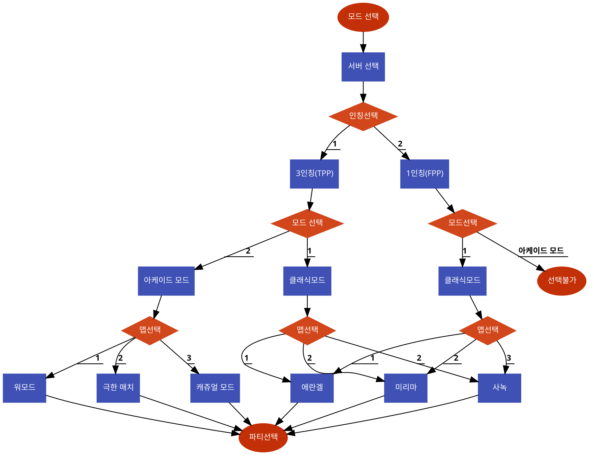

# 시스템 정의
  - 게임플레이 방식을 설정할 수 있는 시스템.
 
# 시스템 설명
  - 모드, 인칭, 맵, 파티, 서버, 매칭방법에 대해 설정 가능
  - 모드마다 일정 레벨을 달성해야 오픈되는 맵이 존재
 
 

# 기본실행순서
  

번호 | 사용자 행위 | 화면상의 결과
:-------: | :-------: | :-------:
1 | 메인화면에서 모드 선택 탭 | 모드선택 창 생성 
2 | 서버선택 | 서버가 선택됨
3| 인칭선택 |  게임내 플레이 시점이 선택됨
4| 모드선택 | 클래식모드 또는 아케이드 모드가 선택됨
5| 맵선택 | 플레이어가 원하는 맵이 선택됨
6| 파티선택 | 1인, 2인, 혹은 3인 파티가 맺어짐

