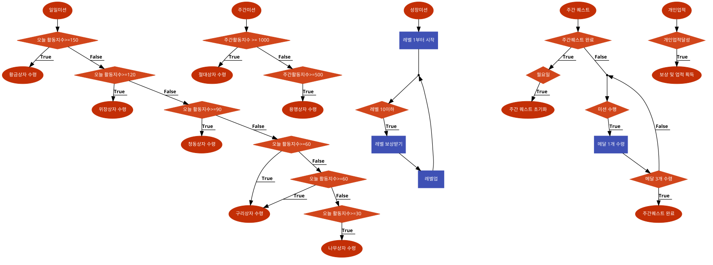

# 시스템 정의
  - 플레이어에게 미션을 제공하여 완수하면 보상을 지급하는 시스템
  
# 시스템 설명
  - 각각의 미션에 대한 기준을 정하고 달성시 아이템과 돈을 지급한다. 
  - 미션의 종류에는 일일 미션, 성장 미션, 주간 퀘스트, 개인 업적이 있으며 미션의 기준에는 플레이 시간, 게임 내에서의 플레이어의 행동, 플레이어 레벨 등이 적용된다.
 
 

# 기본실행순서
  

번호 | 사용자 행위 | 화면상의 결과
:-------: | :-------: | :-------:
1 | 메인화면에서 미션 탭 | 미션 창 생성
2-1 | 일일미션 탭 | 목표 일일활동지수 달성 시 보상획득 버튼 생성
2-2| 주간미션 탭 | 목표 주간활동지수 달성시 보상획득 버튼 생성 
2-3| 성장미션 탭| 레벨업 할 때마다 보상획득 버튼 
2-4| 주간퀘스트 탭| 미션수행 3회 달성시 주간퀘스트 완료 보상획득 버튼 생성
2-5 | 개인업적 탭| 개인 업적 달성 시 보상획득  생성
