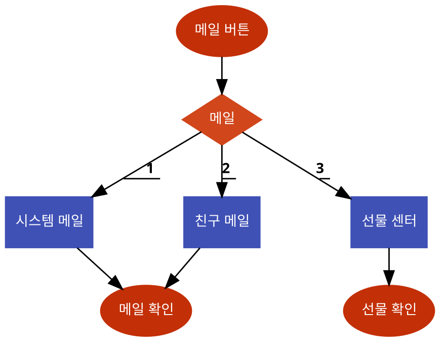

# 시스템 정의
  - 운영진과 플레이어 혹은 플레이어와 플레이어 간에 메일을 주고 받을 수 있는 시스템
  
# 시스템 설명
  - 운영진에게서 받는 메일은 플레이어 공지용으로 사용
  - 등록된 친구끼리 메일을 주고 받을 수 있으며 선물 교환도 
 
 

# 기본실행순서
  

번호 | 사용자 행위 | 화면상의 결과
:-------: | :-------: | :-------:
1 | 메인화면에서 메일 탭 | 메일 창 생성 
2 | 시스템 메일 선택 | 운영진에게서 온 시스템 메일 확인
3| 친구 메일선택|  친구에게서 온 메일 확인
4 | 선물 센터 선택 | 받은 선물 혹은 보낸 선물 확인
