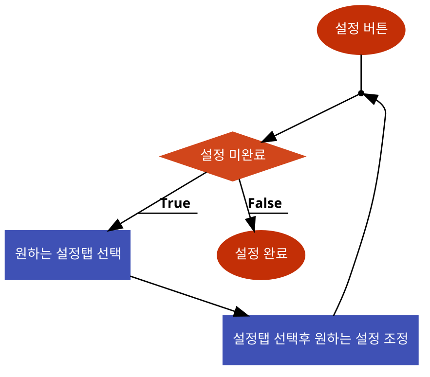

# 시스템 정의
  - 배틀그라운드 모바일의 전체 설정을 관리하는 시스템
  
# 시스템 설명
  - 인게임, 화면, 조작, 차량, 행동, 사운드, 언어 등의 종합적인 설정 관리 시스템
  - 인게임 내 세부적인 요소까지 설정 시스템에서 조절 가능
 
 

# 기본실행순서
  

번호 | 사용자 행위 | 화면상의 결과
:-------: | :-------: | :-------:
1 | 메인화면에서 설정 탭 | 설정 화면 생성
2 | 원하는 설정 선택 | 원하는 설정 조정 화면 생성
3| 원하는 설정 조정 | 설정이 게임 내 적용
4| 설정 미완료 시 추가 설정 실시| 설정이 게임 내 적용
5| 설정 완료 및 화면을 벗어남| 메인화면으로 돌아감 
