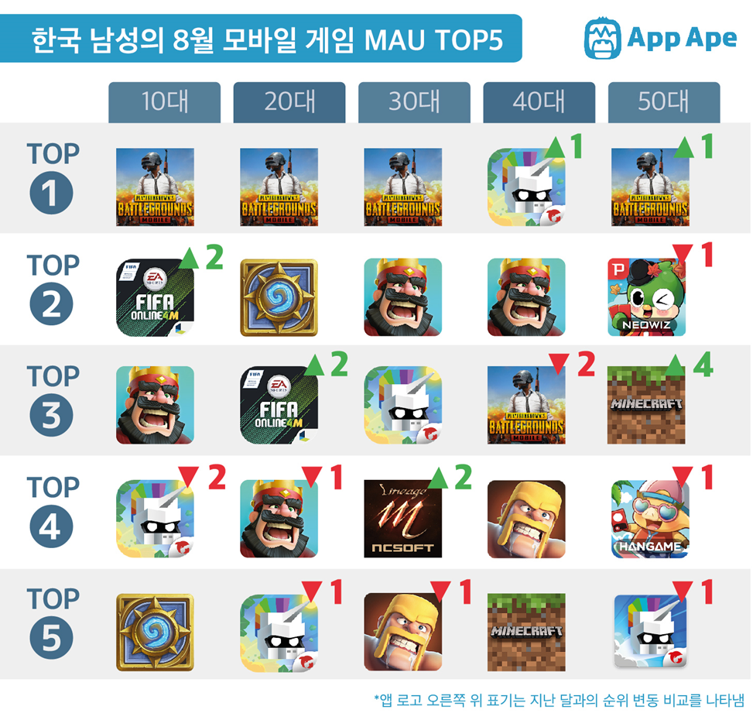
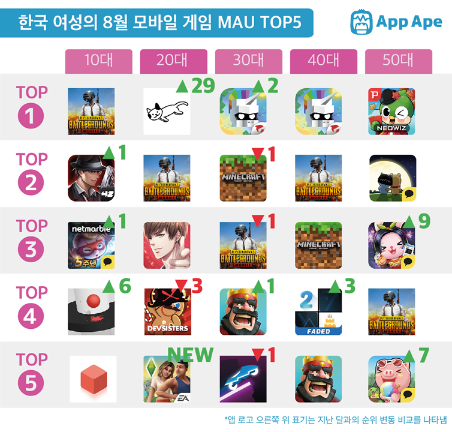

# 모바일게임 시장 분석
## MAU (Monthly Active Users)
  - 한달동안 앱을 사용한 사용자의 수
  - 순위는 매출이나, 다운로드 수로 매길수도 있지만,
  - -> MAU를 사용하면 실제 앱을 사용하는 사용자의 수를 알 수 있음
  - 즉, 실제 해당 게임의 인기를 파악가능

## 8월달 모바일게임 MAU 순위
  - 남자

      
    - 5회 : 배틀그라운드, 의지의히어로
    - 4회 : 클래시로얄
    - 2회 : 피파온라인4, 하스스톤, 클래시오브클랜
    - 1회 : 피망 뉴맞고, 한게임 신맞고, 리니지M, 마인크래프트

  - 여자

      
    - 5회 : 배틀그라운드
    - 2회 : 의지의히어로, 클래시로얄, 마인크래프트
    - 1회 : 애니팡3, 애니팡사천성, 프렌즈팝콘, 피망뉴맞고, Piano tiles2, Rider, 쿠키런, 심즈, 러브앤프로듀서, 고양이귀여워, 마피아42, Helix Jump, 모두의마블

 
## 차트분석
### 장르 분석
- 실시간 대전
    - 전략
  - 클래시로얄, 클래시오브클랜
- 보드게임류
  - 마피아42
  - 피망 뉴맞고
  - 한게임 신맞고
  - 하스스톤
  - 모두의 마블
- 스포츠
  - 피파온라인
- 배틀로얄
  - 배틀그라운드
- 아케이드/퍼즐
  - 아케이드
    - 의지의히어로
  - Rider
  - Helix Jump
  - Piano tiles
  - 쿠키런
  - 1010
    - 퍼즐
    - 애니팡3
  - 애니팡 사천성
  - 프렌즈팝콘
  - 혼자 간단히 할 수 있는 아케이드 게임
- 시뮬레이션
  - 심즈
  - 러브앤프로듀서
  - 고양이는 너무 귀여워
  - 마인크래프트
		  
### 성별 및 연령대별 특징
  - 나이대가 증가할수록 퍼즐게임에 대한 선호도가 증가
  - 남성은 실시간 대전게임이 인기게임의 주를 이루지만 상대적으로 여성은 실시간 대전게임보다 아케이드 및 퍼즐게임에 대한 선호를보임
  - 20대 여성에 한해서 시뮬레이션 장르가 인기
  - 그럼에도 불구하고 배틀그라운드는 전연령대에서 순위를 차지함

# 장르 선정
## 선정배경
+ 인기게임은 장르가 크기 **실시간대전, 아케이드/퍼즐, 시뮬레이션**으로 나뉨
+ 모든 성별, 전연령대를 게임 대성 타겟으로 선정
  + 시뮬레이션은 20대여성 대상으로만 인기 &rarr; 제외
+ 둘 중 **실시간대전** 게임류를 선택하기로 함
+ 실시간대전게임들은 크게 다음과같은 장르가 존재
  + 보드게임류
  + 전략게임류
  + 스포츠게임류
  + **배틀로얄류**
+ 배틀그라운드가 모든 성별, 모든 세대에서 전부 인기 순위권에 듬 &rarr; **남녀노소 인기 많은 배틀로얄 장르를 선정**

## 배틀로얄
+ 개념
  + 오픈 월드맵에서 다수의 플레이어들간의 전투를 통해 한명의 승자를 정하는 방식
+ 현재 모바일 게임시장에서 배틀로얄 장르의 게임 대부분이 배틀그라운드처럼 일반적인 FPS장르
+ 식상하지않고 독특한 장르의 배틀로얄 게임을 만드는 것이 목표