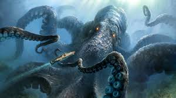
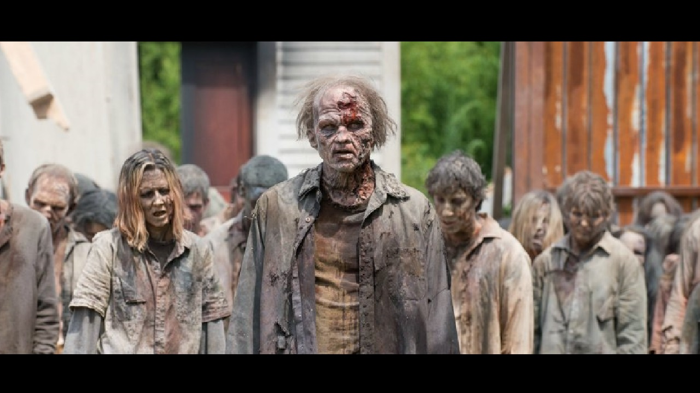
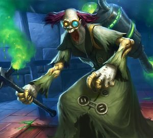
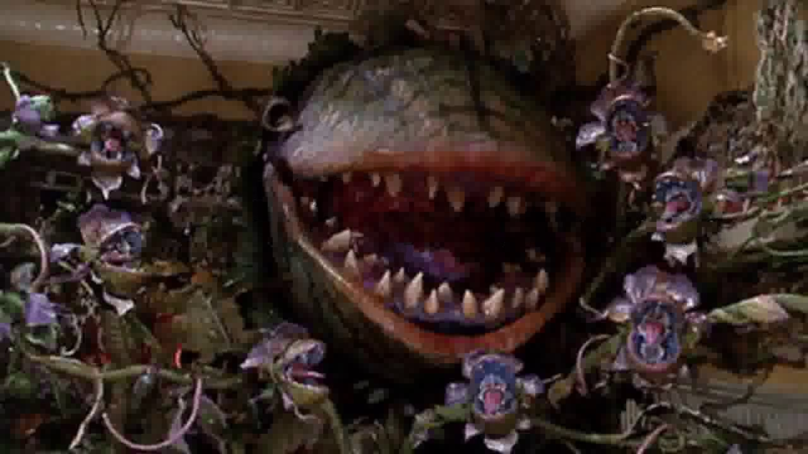
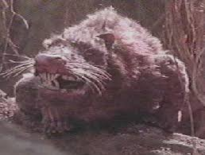
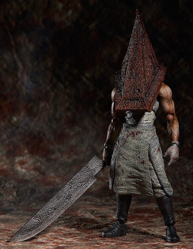
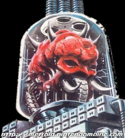

# 게임 스토리
     외딴 섬에서 '유토피아 프로젝트'라는 비밀 프로젝트가 진행 중이었습니다. 
     유토피아 프로젝트는 인간의 수명을 연장시키기 위한 비밀 생체실험 프로젝트였습니다. 
     그러던 어느 날 잘못된 실험으로 괴물들이 탄생하게 되었고, 엎친데 덮친격으로 섬의 모든 연구시설이 통제를 잃어버렸습니다. 
     아무도 섬을 탈출하지 못하고 모든 연구원들이 죽음을 맞이하게 되었고, 섬은 그 뒤로 모두에게 잊혀지고 버려졌습니다. 
     10년 뒤, 비행기 한대가 원인모를 추락으로 섬에 불시착 하게 되었습니다. 
     탈출할 수 있는 보트는 단 2대, 사람들은 괴물들을 피해서 버려진 섬을 탈출해야 합니다.

# 괴물 컨셉
## 크라켄

    실험실에서 유출된 화학약품은 섬 주변의 바다생물들 역시 오염시켰습니다. 약품에 노출된 문어는 바다에서 가장 강력한 포식자로 진화했습니다. 
## 좀비

    실수로 탄생한 좀비바이러스는 급속도로 섬의 사람들에게 퍼져버렸습니다. 감염된 사람들은 지적능력을 상실하고 보이는대로 공격할 뿐인 살아움직이는 시체가 되었습니다. 
## 매드사이언티스트

    괴물들이 가득한 섬에 홀로 남겨진 과학자는 미쳐버리고 말았습니다. 자기자신에게 생체실험을 강행했고, 그는 이 섬에서 살아남을만큼 강해졌습니다. 
## 포르기네이

    실험실에서 유출된 화학약품은 섬의 식물들 역시 오염시켰습니다. 작은 벌레만을 잡아먹던 벌레잡이 식물들은 이제 동물들을 잡아먹을 수 있을 정도로 거대해졌습니다. 
## 모르모트

    실험을 통해서 매우 거대해진 실험용 생쥐 모르모트는 철저한 연구소의 관리 내에서 실험되고 있었습니다. 하지만 연구실이 무너지고 실험실을 탈출한 모르모트는 섬을 마음껏 돌아다니게 되었습니다.
## 도살자
 

   사형수였던 그는 섬에서 비밀리에 진행되는 인체실험 대상이 되었습니다. 약품을 통해 강력한 신체를 갖게 되었지만, 오직 살아있는 생명체를 죽이는게 삶의 목표인 괴물이 되어버렸습니다.
## 마더브레인
 

   섬의 연구시설을 관리하던 인공지능이었던 마더브레인은 어느 순간 자아를 가지게 되었습니다. 그 후 섬의 모든 시설을 통제하고, 연구원들을 정리한 뒤 자신만의 왕국을 만들었습니다.
