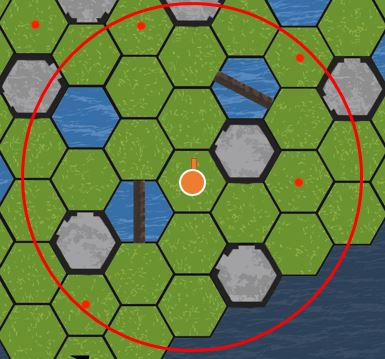
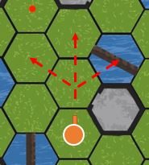
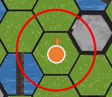

# 무기 우선순위
우선순위 | 무기종류
:-------: | :-------:
0 | 섬광탄, 회복아이템
1 | 너클
2 | 칼
3 | 망치
4 | 권총
5 | 스나이퍼
6 | 활과화살
7 | 수류탄

- 우선순위가 빠른 무기의 데미지가 먼저 적용
- 우선순위가 빠른 아이템의 효과가 먼저 적용

# 무기
## 원거리류

무기명 | 공격력 | 사거리 | 카드개수
:-------: | :-------: | :-------: | :-------: |
권총 | 5 6 7 | 1 | 3장(일반)
스나이퍼 | 8 10 15 | 2 | 1장 (연구실)
활과화살 | 7 8 10 | 1 | 2장 (일반)
수류탄 | 5 | 3 | 1장 (연구실)

- 원거리 무기는 구슬굴리기 결과를 통해 데미지가 1,2,3단계로 결정됨
- 수류탄은 한번 사용하면 사라짐
- 사거리별 공격범위
    - 수류탄 (3)

        

        - 벽등의 제한 없이 공격가능
        
    - 스나이퍼 (2)

        

        - 벽을 뚫고 공격불가

    - 활과화살, 권총 (1)

        
        
        - 벽을 뚫고 공격불가

## 근거리류

무기명 | 공격력 | 카드개수
:-------: | :-------: | :-------:
맨손 | 1 | 기본상태
너클 | 2 | 4장 (일반)
칼 | 3 | 4장 (일반)
망치 | 4 | 4장 (일반)

- 근접무기는 항상 1단계 데미지로 간주

# 방어구
방어구명 | 방어력 | 카드개수
:-------: | :-------: | :-------:
오토바이헬멧 | 1 2 5 | 4장 (일반)
방탄조끼 | 2 4 1 | 4장 (일반)

- 방어구는 사용시 방어력만큼 데미지를 막아주고 사라짐
- 무기의 데미지가 1단계,2단계,3단계이느냐에 따라서 방어구의 방어력도 달라짐

# 특수장비
무기명 | 능력 | 카드개수
:-------: | :-------: | :-------:
방패 | 현재 받은 공격으로 플레이어가 사망하는 경우 데미지 무효화 (사용시 사라짐)  | 1장 (연구실)
섬광탄 | 다음턴에 사용상대를 이동불가능하게 만듬 (사거리 3) | 3장 (연구실)
제초제 | 사용시 1칸 이내로 근접한 포르기네이의 식물영역 제거가능 | 1장 (연구실)
전기충격기 | 보유시 크라켄 존재해도 1회 다리통과 가능 (통과시 사라짐) | 1장 (연구실)
치즈 | 보유시 모르모트의 공격 1회 무효화 (피격시 사라짐) | 1장 (연구실)
방독면 | 보유시 매드사이언티스트의 독가스 데미지 무효화 | 1장 (연구실)
백신 | 사용시 좀비스택 초기화 | 1장 (연구실)

# 회복아이템
아이템명 | 회복량 | 카드개수
:-------: | :-------: | :-------:
붕대 | 2 | 10장 (일반)
주사기 | 15 | 3장 (일반)

# 카드덱 구성
## 일반 아이템 카드 : 40장

아이템명 |  카드개수
:-------:  | :-------:
붕대 | 10장
오토바이헬멧 |  5장
방탄조끼 |  5장
너클 | 4장
칼 | 4장
망치 | 4장
주사기 |  3장
권총 |  3장
활과화살 |  2장

## 연구실 아이템 카드 : 15장

아이템명 |  카드개수
:-------:  | :-------:
열쇠 | 4장
섬광탄 |  3장
수류탄  | 1장
스나이퍼 |  1장
방패 |  1장
제초제 |  1장
전기충격기 |  1장
치즈 |  1장
방독면 |  1장
백신 |  1장
