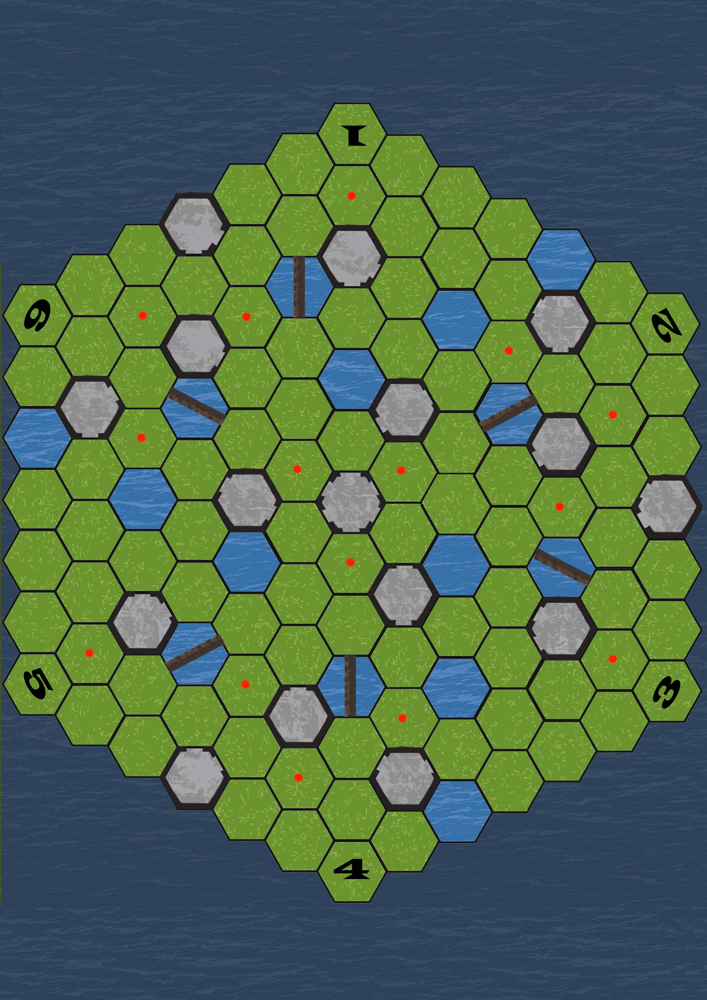
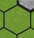
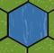
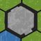
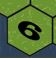
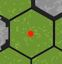

# 맵형태

- 플레이어들이 전투를 벌이는 섬을 형상화
- 작은 육각형의 타일로 이루어진 큰 육각형 모양
    - 총 91개의 육각형으로 구성됨
- 플레이어는 현재 위치의 육각혀엥서 변이 맞닿는 육각형으로 이동 가능
    - 다양한 이동의 경우의 수를 위해 육각형으로 구성
- 땅, 물, 연구실 타입의 타일이 존재
- 게임밸런스를 위해 맵을 3등분 했을 때, 각 부분들의 타일 구성은 동일하게 구성
- 맵의 6개의 꼭짓점에는 번호가 매겨지고 플레이어 시작 지점 및 보트의 위치를 결정하는데 사용됨

# 타일
## 땅타일

- 총 61칸
- 가장 일반적인 맵타일
- 땅타일로 이동한 플레이어는 일반 아이템 카드덱에서 아이템을 드로우
## 물타일

- 총 15칸
- 이동 할 수 없는 맵타일
- 다리가 존재하는 물타일은 해당 방향의 땅타일 간으로만 이동가능
## 연구실 타일

- 총 15칸
- 벽부분을 통해서는 연구실 타일로 이동 불가능하며, 반드시 입구를 통해서만 진입가능
- 연구실 타일로 이동한 플레이어는 연구실 아이템 카드덱에서 아이템을 드로우
    - 이미 방문된 연구실 타일인 경우 아이템 획득 불가능

# 플레이어 시작 지점

- 각각의 시작 지점에는 1~6까지의 번호가 매겨짐
- 게임 시작시 주사위를 던져서 4곳은 플레이어 시작지점 2곳은 탈출지점으로 정해짐
# 좀비 시작 지점

- 이번 게임의 괴물이 좀비일 경우 좀비들이 위치하게 되는 15개의 지점